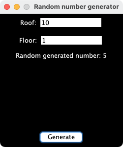

# Random Number Generator - RNG
A simple number generator written in Java that generates a random number within a specified range.
This generator also has a UI that is simple and straightforward.

For now the Java.lang.Math library is used to generate random numbers
but that can be changed to using something more sophisticated such as the computer clock in order to generate "more randomness" (better seed etc).

### Run the program
To run the program, simply run the following in the terminal:
```zsh
$ make run
```

### Recompile the program
```zsh
$ make all
```

